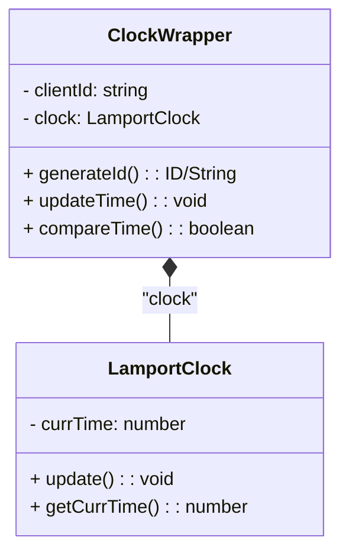

```mermaid
classDiagram
    class LamportClock {
        - currTime: number
        + update(): void
        + getCurrTime(): number
    }

    class ClockWrapper {
        - clientId: string
        - clock: LamportClock
        + generateId(): ID/String
        + updateTime(): void
        + compareTime(): boolean
    }

    ClockWrapper *-- LamportClock : "clock"

```
