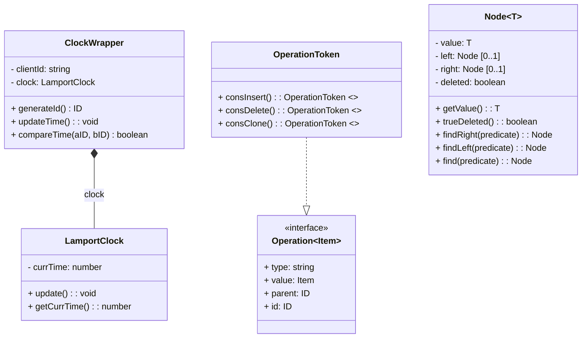

```mermaid
classDiagram
    class LamportClock {
        - currTime: number
        + update(): void
        + getCurrTime(): number
    }

    class ClockWrapper {
        - clientId: string
        - clock: LamportClock
        + generateId() ID
        + updateTime(): void
        + compareTime(aID, bID) boolean
    }
    
    class Operation~Item~ {
        <<interface>>
        + type: string
        + value: Item
        + parent: ID
        + id: ID
    }

    class OperationToken {
        + consInsert(): OperationToken <<static>>
        + consDelete(): OperationToken <<static>>
        + consClone(): OperationToken <<static>>
    }

    class Node~T~ {
        - value: T
        - left: Node<T> [0..1]
        - right: Node<T> [0..1]
        - deleted: boolean
        + getValue(): T
        + trueDeleted(): boolean
        + findRight(predicate): Node<T>
        + findLeft(predicate): Node<T>
        + find(predicate): Node<T>
    }

    

    ClockWrapper *-- LamportClock : clock
    OperationToken ..|> Operation
```
